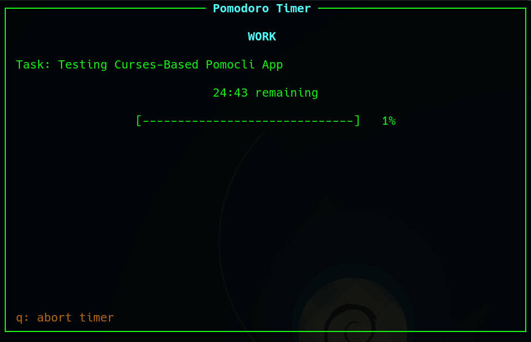
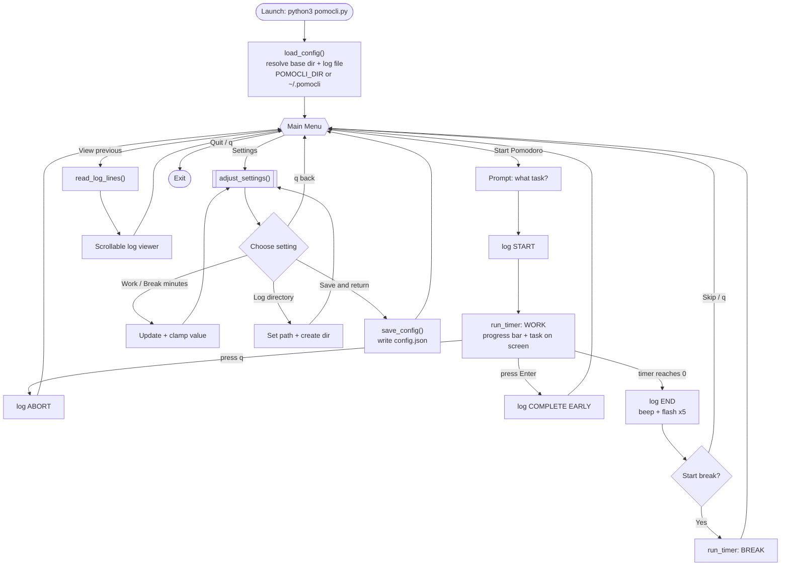

# PomoCLI 🍅

A curses-based Pomodoro timer for terminal people who want focus sessions, keyboard-driven menus, and logs they can grep later.

No accounts. No dashboards. No productivity gamification.
Just: pick a task, run a timer, take a break, repeat.

---



---

## Overview

PomoCLI is a terminal UI written in Python using curses. It is designed for people who already live in a terminal and want a Pomodoro tool that stays fast, local, and honest.

The application supports:

- Starting a Pomodoro session with an explicit task
- Displaying that task while the timer runs
- Loud, unmissable completion alerts
- Viewing past sessions from a plain-text log
- Editing work and break durations via an in-app settings menu

Everything runs locally. Nothing phones home.

---

## Features

- Curses-based TUI  
  Menu-driven interface with keyboard navigation and a dedicated timer screen.

- Task visibility  
  Whatever you enter for What are you working on stays visible during the active timer.

- Configurable durations  
  Work and break lengths can be adjusted in-app and persist across runs.

- Complete early  
  Finish a running Pomodoro before the timer expires by pressing Enter. The session is logged as COMPLETE EARLY.

- Configurable file location  
  The directory PomoCLI writes to can be set in-app or via the `POMOCLI_DIR` environment variable, and the log directory can be pointed anywhere you like.

- Graphics mode (ASCII or Unicode)  
  Defaults to a portable ASCII progress bar and art that works on any terminal. If your font supports block glyphs, switch to the Unicode look in Settings.

- Completion alert  
  Timer completion triggers a terminal bell and a full-screen flash, repeated five times.

- Plain-text logging  
  Sessions are appended to a human-readable text file with timestamps and session state.

- Built-in log viewer  
  Scroll and page through previous Pomodoros directly inside the terminal UI.

- Zero external dependencies  
  Uses only the Python standard library.

---

## Requirements

- Python 3.9 or newer
- A terminal that supports curses

**Note:** Native Windows terminals have limited curses support. This tool is intended primarily for macOS and Linux environments.

---

## Installation

Clone the repository and run the script directly:

```bash
git clone https://github.com/asyrewicze/pomocli.git
cd pomocli
python3 pomocli.py
```

Optional: make the script executable and run it directly:

```bash
    chmod +x pomocli.py
    ./pomocli.py
```

---

## Usage

Launch the application:

```bash
python3 pomocli.py
```

You will be presented with a main menu that allows you to:

- Start a Pomodoro
- View previous Pomodoros
- Adjust settings
- Quit the application

---

## How It Works

At launch, PomoCLI resolves its file locations, loads (or creates) its config, and drops you into a keyboard-driven main menu loop. From there, each menu option is a self-contained flow that returns to the menu when it finishes. Every session transition is appended to the log.



**Files touched at runtime**

- `<base>/config.json` — read on load, written on Save. Base dir is `POMOCLI_DIR` if set, otherwise `~/.pomocli`.
- `<log_dir>/pomocli_log.txt` — appended on every session transition. `<log_dir>` defaults to the base dir and is configurable in Settings.

Both parent directories are created automatically before any write, so the first run never fails on a missing folder.

---

## Key Bindings

Menus:
- Up and Down arrows to navigate
- Enter to select
- q to go back or quit

Timer screen:
- q to abort the active timer (logged as ABORT)
- Enter to complete the Pomodoro early (logged as COMPLETE EARLY)

Log viewer:
- Up and Down arrows to scroll
- Page Up and Page Down to move by page
- Home and End to jump to start or end
- q to exit the viewer

---

## Configuration

By default, PomoCLI keeps everything in a dedicated directory:

```bash
~/.pomocli/
├── config.json        # settings
└── pomocli_log.txt    # session log
```

The directory is created automatically on first run. Configuration is stored in `config.json`:

```bash
    {
      "work_minutes": 25,
      "break_minutes": 5,
      "log_dir": "/Users/you/.pomocli",
      "use_unicode": false
    }
```

You may edit this file manually, but the recommended approach is to use the Settings option inside the application.

### Graphics mode

The timer's progress bar and art render in ASCII by default (`"use_unicode": false`), which works on every terminal. If your terminal font includes block-drawing glyphs (`█ ░ ▒ ▓`), toggle **Settings → Graphics** to Unicode for a fancier look. If you see `?` characters where the bar or art should be, your font doesn't support those glyphs — stay on ASCII.

### Choosing where files live

There are two ways to change PomoCLI's location:

- **`POMOCLI_DIR` environment variable** — sets the base directory for both the config file and the default log location. Useful for keeping PomoCLI's data with your dotfiles or on another volume:

  ```bash
  POMOCLI_DIR=~/dotfiles/pomocli python3 pomocli.py
  ```

- **Settings → Log directory** — sets where the log file is written (independent of the config location). The path is created if it does not exist and is remembered across runs. `~` is expanded, so entries like `~/Documents/pomodoros` work.

The config file always lives at `<base>/config.json` so PomoCLI can find its settings before reading them.

---

## Logs

Pomodoro sessions are logged to a plain-text file, `pomocli_log.txt`, inside the configured log directory (by default `~/.pomocli/pomocli_log.txt`).

Each entry includes a timestamp, session state, and task description. Example:

```bash
    2026-01-18 T=14:05 - START: Fix README formatting
    2026-01-18 T=14:22 - COMPLETE EARLY: Fix README formatting
    2026-01-18 T=14:25 - START: Reply to email
    2026-01-18 T=14:50 - END: Reply to email
```

Session states are `START`, `END`, `ABORT`, and `COMPLETE EARLY`. The log format is intentionally simple so it can be grepped, parsed, or archived without tooling.

---

## Philosophy

PomoCLI is intentionally:

- Terminal-first
- Minimal
- Opinionated
- Text-file driven

If you want charts, cloud sync, or productivity gamification, this is not that tool.

If you want a Pomodoro timer that integrates cleanly into a terminal command center and stays out of your way, PomoCLI does exactly that.

---

## License

As of 01/18/2026, pomocli is licensed under GPLv3 (GNU Public License v3.0)
