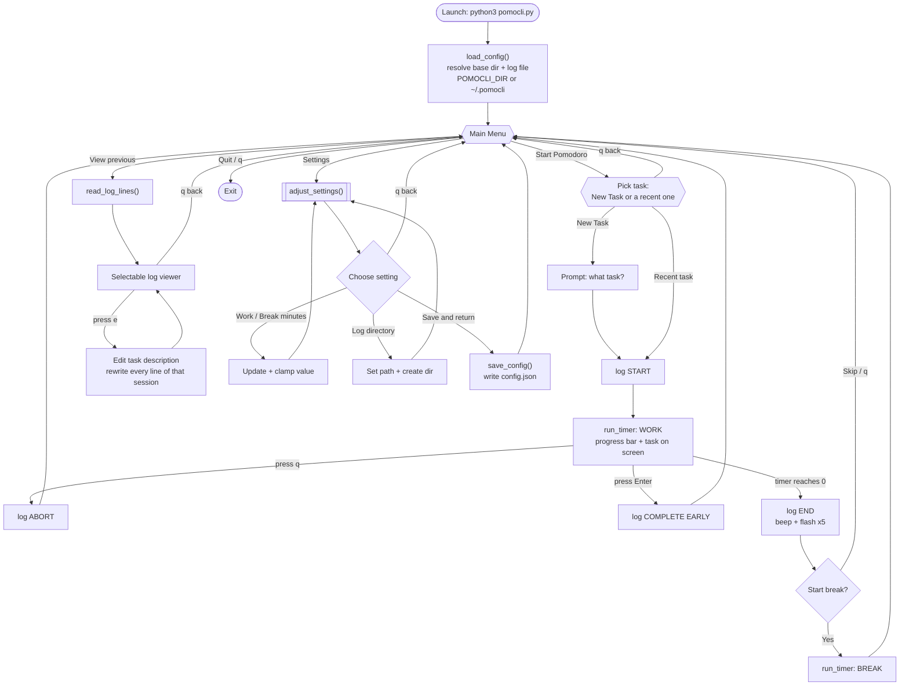

# PomoCLI 🍅

A curses-based Pomodoro timer for terminal people who want focus sessions, keyboard-driven menus, and logs they can grep later.

No accounts. No dashboards. No productivity gamification.
Just: pick a task, run a timer, take a break, repeat.

---


---

## Overview

PomoCLI is a terminal UI written in Python using curses. It is designed for people who already live in a terminal and want a Pomodoro tool that stays fast, local, and honest.

The application supports:

- Starting a Pomodoro session with an explicit task, or picking up a recent one
- Displaying that task while the timer runs
- Loud, unmissable completion alerts
- Viewing past sessions from a plain-text log, and correcting their task text
- Editing work and break durations via an in-app settings menu

Everything runs locally. Nothing phones home.

---

## Features

- Curses-based TUI  
  Menu-driven interface with keyboard navigation and a dedicated timer screen.

- Task visibility  
  Whatever you enter for What are you working on stays visible during the active timer.

- Pick up where you left off  
  Starting a Pomodoro offers your recently worked-on tasks alongside New Task, with how many Pomodoros each has and when you last touched it. Selecting one reuses the exact description, so follow-up sessions group together in the log instead of scattering across near-identical retyped strings.

- Editable task history  
  Fix a typo, or rename a task you described badly at 9am, from inside the log viewer. All the log lines belonging to that Pomodoro are updated together; timestamps and session states are never touched.

- Configurable durations  
  Work and break lengths can be adjusted in-app and persist across runs.

- Complete early  
  Finish a running Pomodoro before the timer expires by pressing Enter. The session is logged as COMPLETE EARLY.

- Configurable file location  
  The directory PomoCLI writes to can be set in-app or via the `POMOCLI_DIR` environment variable, and the log directory can be pointed anywhere you like.

- Graphics mode (ASCII or Unicode)  
  Defaults to a portable ASCII progress bar and art that works on any terminal. If your font supports block glyphs, switch to the Unicode look in Settings - including on macOS, which PomoCLI handles automatically.

- Completion alert  
  Timer completion triggers a terminal bell and a full-screen flash, repeated five times.

- Plain-text logging  
  Sessions are appended to a human-readable text file with timestamps and session state.

- Built-in log viewer  
  Scroll, page, and select through previous Pomodoros directly inside the terminal UI.

- Zero external dependencies  
  Uses only the Python standard library.

---

## Requirements

- Python 3.9 or newer
- A terminal that supports curses

**Note:** Native Windows terminals have limited curses support. This tool is intended primarily for macOS and Linux environments.

---

## Installation

Clone the repository and run the script directly:

```bash
git clone https://github.com/asyrewicze/pomocli.git
cd pomocli
python3 pomocli.py
```

Optional: make the script executable and run it directly:

```bash
    chmod +x pomocli.py
    ./pomocli.py
```

---

## Usage

Launch the application:

```bash
python3 pomocli.py
```

You will be presented with a main menu that allows you to:

- Start a Pomodoro
- View previous Pomodoros
- Adjust settings
- Quit the application

---

## How It Works

At launch, PomoCLI resolves its file locations, loads (or creates) its config, and drops you into a keyboard-driven main menu loop. From there, each menu option is a self-contained flow that returns to the menu when it finishes. Every session transition is appended to the log.



**Files touched at runtime**

- `<base>/config.json` - read on load, written on Save. Base dir is `POMOCLI_DIR` if set, otherwise `~/.pomocli`.
- `<log_dir>/pomocli_log.txt` - appended on every session transition. `<log_dir>` defaults to the base dir and is configurable in Settings.

Both parent directories are created automatically before any write, so the first run never fails on a missing folder.

---

## Key Bindings

Menus:
- Up and Down arrows to navigate
- Enter to select
- q to go back or quit

Timer screen:
- q to abort the active timer (logged as ABORT)
- Enter to complete the Pomodoro early (logged as COMPLETE EARLY)

Log viewer:
- Up and Down arrows to move the selection
- Page Up and Page Down to move by page
- Home and End to jump to start or end
- e to edit the selected entry's task description
- q to exit the viewer

Edit prompt:
- Opens prefilled with the current description
- Backspace to erase, Enter to save, ESC to cancel

---

## Configuration

By default, PomoCLI keeps everything in a dedicated directory:

```bash
~/.pomocli/
├── config.json        # settings
└── pomocli_log.txt    # session log
```

The directory is created automatically on first run. Configuration is stored in `config.json`:

```bash
    {
      "work_minutes": 25,
      "break_minutes": 5,
      "log_dir": "/Users/you/.pomocli",
      "use_unicode": false
    }
```

You may edit this file manually, but the recommended approach is to use the Settings option inside the application.

### Graphics mode

The timer's progress bar and art come in two styles, selectable via **Settings → Graphics** and persisted as `use_unicode` in the config:

- **ASCII** (default) - a `[####----]` progress bar and simple ASCII art. Works on every terminal, everywhere.
- **Unicode** - a smoother bar and shaded art using block glyphs (`█ ░ ▒ ▓`). Nicer, but needs a font that has the glyphs.

#### Why ASCII is the default

ASCII is the default because it is the one setting guaranteed to work anywhere - every terminal, every font, every locale. It is a conservative default, not a warning that Unicode is broken.

Unicode mode works on Linux and macOS. On Windows it remains unreliable (see below).

#### The macOS `rep` problem, and how PomoCLI handles it

Earlier versions of this README said Unicode mode was a dead end on macOS. That was wrong, and the real cause turned out to be narrow enough to fix outright.

PomoCLI is a **curses** app, so it draws through `ncurses` rather than writing to the terminal directly. On macOS, Python's `curses` links against Apple's byte-oriented system ncurses (`/usr/lib/libncurses.5.4.dylib`). When a terminal's terminfo advertises the **`rep`** capability, ncurses compresses a run of identical characters into one character plus the `ESC[Nb` repeat sequence - but this build does it **one byte at a time**. A run of 30 `█` (`e2 96 88` repeated) leaves the process as the trailing byte `0x88` plus a repeat count, and the terminal draws the debris as `?`.

Two things follow from that, and both match what people actually saw:

- **Only runs corrupt.** A lone multibyte glyph is emitted intact. That is why the progress bar and the tomato art broke while everything else looked fine.
- **It is a terminfo problem, not a font, locale, or emulator problem.** On macOS's terminfo database `xterm-kitty` advertises `rep` and `xterm-256color` does not. Same terminal, same Python, same font - the capability is the whole difference. (Which entries carry `rep` is a property of the database, not a constant: ncurses 6.5 as shipped on Debian 13 gives it to `xterm-256color` and `xterm` too.)

So **on macOS**, at startup PomoCLI checks whether the active `TERM` advertises `rep`, and if it does, swaps `TERM` for the first entry that does not - `xterm-256color`, then `xterm` - before curses initializes. Unicode mode then renders correctly. You do not need to configure anything, install anything, or build a custom Python.

Three rules keep the swap from doing harm:

- **It only runs on macOS.** Every other platform links wide `ncursesw`, which emits runs of multibyte characters intact, so there is nothing to fix and no reason to touch `TERM`.
- **A candidate must keep the capabilities PomoCLI uses**, `civis` (hide the cursor) among them. This is why `vt100` is not a candidate despite being rep-less: it cannot hide the cursor, and `curses.curs_set()` raises rather than shrugging.
- **If no candidate qualifies, `TERM` is left alone.** A terminal that draws `?` still runs, and Settings offers ASCII mode; a downgraded one might not run at all.

To opt out and keep your terminal's own `TERM` entry, set `POMOCLI_KEEP_TERM=1`:

```bash
POMOCLI_KEEP_TERM=1 python3 pomocli.py
```

Expect Unicode graphics to show `?` when you do, on any macOS terminal whose terminfo advertises `rep`. Off macOS the variable has no effect, because no swap happens there in the first place.

#### Getting Unicode mode to work

Whatever the platform, two things must both be true: your terminal must use a **UTF-8 locale** (check with `locale`; look for `UTF-8`) and a **font that includes the block glyphs** (most monospace fonts do).

- **Linux:** the easy case. Distro Python links wide ncurses (`ncursesw`), which handles runs of multibyte characters correctly, so Unicode mode works out of the box in any UTF-8 terminal with a suitable font. If you still see `?`, confirm your locale is UTF-8 (`echo $LANG`) rather than `C`/`POSIX`.

- **macOS:** works, via the `TERM` swap described above. If you see `?`, check your locale first (`echo $LANG` should contain `UTF-8`), then confirm you have not set `POMOCLI_KEEP_TERM`.

- **Windows:** curses is not part of the standard library on Windows, so PomoCLI needs the `windows-curses` package (`pip install windows-curses`), which is built on PDCurses and has inconsistent wide-character support. This is a genuinely different problem from the macOS one and the `TERM` swap does not address it - expect ASCII to be the dependable choice here. For the full Unicode experience on Windows, run PomoCLI under **WSL** (Windows Subsystem for Linux) in Windows Terminal with a font like Cascadia Mono; inside WSL it behaves exactly like the Linux case above.

### Choosing where files live

There are two ways to change PomoCLI's location:

- **`POMOCLI_DIR` environment variable** - sets the base directory for both the config file and the default log location. Useful for keeping PomoCLI's data with your dotfiles or on another volume:

  ```bash
  POMOCLI_DIR=~/dotfiles/pomocli python3 pomocli.py
  ```

- **Settings → Log directory** - sets where the log file is written (independent of the config location). The path is created if it does not exist and is remembered across runs. `~` is expanded, so entries like `~/Documents/pomodoros` work.

The config file always lives at `<base>/config.json` so PomoCLI can find its settings before reading them.

### Environment variables

- **`POMOCLI_DIR`** - base directory for `config.json` and the default log location (default: `~/.pomocli`).
- **`POMOCLI_KEEP_TERM`** - macOS only: set to `1` to keep your terminal's own `TERM` entry instead of swapping it for a `rep`-less one. See [the macOS `rep` problem](#the-macos-rep-problem-and-how-pomocli-handles-it).

---

## Logs

Pomodoro sessions are logged to a plain-text file, `pomocli_log.txt`, inside the configured log directory (by default `~/.pomocli/pomocli_log.txt`).

Each entry includes a timestamp, session state, and task description. Example:

```bash
    2026-01-18 T=14:05 - START: Fix README formatting
    2026-01-18 T=14:22 - COMPLETE EARLY: Fix README formatting
    2026-01-18 T=14:25 - START: Reply to email
    2026-01-18 T=14:50 - END: Reply to email
```

Session states are `START`, `END`, `ABORT`, and `COMPLETE EARLY`. The log format is intentionally simple so it can be grepped, parsed, or archived without tooling.

Task descriptions can be corrected in place from the log viewer (select an entry, press `e`). Editing rewrites every line belonging to that Pomodoro, so the two lines above would be renamed together. The rewrite goes through a temporary file and is moved into place, so an interrupted edit cannot truncate the log. Lines that do not match the format above - anything hand-edited in - are left alone and cannot be edited from the viewer.

The log is re-read immediately before an edit is written, so a second PomoCLI instance that finished a Pomodoro while the viewer sat open does not lose its entries. If the lines being edited changed on disk in the meantime, the edit is refused and the viewer reloads rather than overwriting someone else's work.

---

## Philosophy

PomoCLI is intentionally:

- Terminal-first
- Minimal
- Opinionated
- Text-file driven

If you want charts, cloud sync, or productivity gamification, this is not that tool.

If you want a Pomodoro timer that integrates cleanly into a terminal command center and stays out of your way, PomoCLI does exactly that.

---

## License

As of 01/18/2026, pomocli is licensed under GPLv3 (GNU Public License v3.0)
